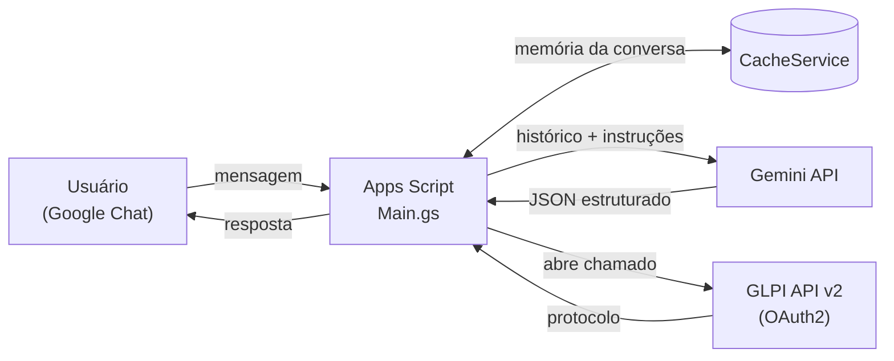
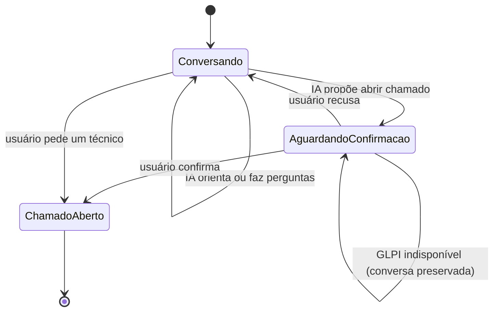

# Assistente de Suporte de TI para Google Chat


Assistente virtual de suporte de TI que conversa em linguagem natural pelo **Google Chat**, resolve problemas simples de nível 1 e, quando precisa de um técnico, **abre o chamado no GLPI automaticamente**, com a confirmação do usuário.

> **English:** AI-powered IT helpdesk assistant for Google Chat. Built with Google Apps Script, it uses the Gemini API to troubleshoot common issues in natural language and automatically opens GLPI tickets when human support is needed.

## Sobre o projeto

Desenvolvi este assistente como analista de suporte de TI em uma instituição de ensino superior, para reduzir a demanda repetitiva de nível 1 (senhas, impressoras, Wi-Fi, acesso a sistemas) e fazer os chamados chegarem ao GLPI já descritos e categorizados.

Ele roda inteiro dentro do Google Workspace, sem servidor próprio: o Google Chat envia as mensagens para o Apps Script, a IA conduz o diagnóstico e o GLPI recebe o chamado quando o problema precisa de um técnico.

Esta é a versão pública do projeto. Os dados da instituição (procedimentos internos, identificadores e credenciais) foram removidos e substituídos por configurações de exemplo.

## Funcionalidades

- **Conversa natural:** entende mensagens informais e incompletas ("meu pc não liga", "tá dando erro") e faz uma pergunta de diagnóstico por vez.
- **Triagem de nível 1:** orienta o usuário com base em procedimentos configuráveis (senha, impressora, rede, sistemas acadêmicos).
- **Chamado com confirmação:** a IA propõe abrir o chamado e só abre depois de um "sim" explícito.
- **Pedido direto:** "falar com técnico" ou "abrir chamado" escala na hora, sem passar pela IA.
- **Categorização automática:** cada chamado chega ao GLPI na categoria certa, com o resumo do problema.
- **Memória por usuário:** cada pessoa tem sua própria conversa, reiniciada após 1 hora sem mensagens.
- **Resiliente a falhas:** troca de modelo de IA quando o principal está indisponível, renova o token do GLPI automaticamente e **não perde a conversa** se a abertura do chamado falhar.

## Exemplo de conversa

*Exemplo ilustrativo:*

> **Usuário:** bom dia, a impressora não está imprimindo
>
> **Assistente:** Bom dia! Você está usando um notebook ou um computador fixo da instituição?
>
> **Usuário:** notebook, estou em casa
>
> **Assistente:** Para imprimir de fora da instituição pelo notebook, é preciso estar com a VPN ativada. Pode verificar se ela está conectada?
>
> **Usuário:** tá ligada e mesmo assim não vai
>
> **Assistente:** Entendi. Posso abrir um chamado para que o suporte de TI continue o atendimento? (sim ou não)
>
> **Usuário:** sim
>
> **Assistente:** Prontinho, já abri um chamado para o suporte de TI continuar o atendimento. Protocolo: #1234

## Arquitetura



### Fluxo de atendimento



## Tecnologias

| Camada | Tecnologia |
|---|---|
| Canal | Google Chat (app no formato de complemento do Google Workspace) |
| Back-end | Google Apps Script (runtime V8) |
| IA | Gemini API com saída estruturada (JSON Schema) |
| Chamados | GLPI API v2 com OAuth2 |
| Estado e configuração | CacheService e PropertiesService do Apps Script |
| Testes | Node.js (`node:test`) com os serviços do Google simulados |

## Estrutura do projeto

```
assistente-ti-google-chat/
├── src/
│   ├── Config.gs        # organização, categorias do GLPI e base de conhecimento
│   ├── Main.gs          # eventos do Chat e fluxo principal do atendimento
│   ├── Estado.gs        # memória da conversa por usuário
│   ├── Gemini.gs        # instruções da IA e chamada à API com fallback de modelo
│   ├── Glpi.gs          # autenticação OAuth2 e abertura de chamados
│   └── appsscript.json  # manifesto do Apps Script
├── tests/
│   └── simulacao.test.js
├── docs/
│   └── configuracao.md  # passo a passo de implantação
├── CHANGELOG.md
└── package.json
```

## Como implantar

Resumo (o passo a passo completo está em [docs/configuracao.md](docs/configuracao.md)):

1. Crie um projeto no Apps Script e copie os arquivos de `src/`.
2. Cadastre as credenciais nas **Propriedades do Script** (chave do Gemini e cliente OAuth do GLPI).
3. Personalize `src/Config.gs` com os dados e procedimentos da sua organização.
4. Ative a Google Chat API no Google Cloud e aponte o app para a implantação do Apps Script.
5. Implante uma nova versão e converse com o app no Google Chat.

## Testes

Os testes rodam o código do Apps Script em Node.js, simulando o Google Chat, a API do Gemini e o GLPI:

```bash
npm test
```

Cenários cobertos:

- Resposta a uma saudação e registro do histórico.
- Fluxo completo: proposta → confirmação → chamado aberto no GLPI.
- Falha no GLPI sem perder a conversa (teste de regressão).
- Troca para o modelo reserva quando o principal está indisponível.
- Pedido direto de técnico, sem consultar a IA.
- Reinício da conversa após 1 hora de inatividade.
- Resposta amigável quando a IA falha.
- Reaproveitamento do token do GLPI em cache.

## Decisões técnicas e desafios

- **Respostas estruturadas em vez de texto livre.** A IA responde num JSON validado por schema (`resposta`, `propor_chamado`, `confirmar_abertura`, `categoria`, `resumo`). O código decide o que fazer a partir desses campos, sem tentar interpretar frases.
- **Nenhuma ação sem confirmação.** O chamado só é aberto depois de um "sim" explícito, garantido por uma regra nas instruções da IA e por um estado `aguardandoConfirmacao` no código.
- **Limite de 30 segundos do Google Chat.** Pelos logs do Cloud Logging, identifiquei respostas lentas e erros 503 do modelo que estouravam o tempo de resposta. A solução foi uma tentativa por modelo, com troca automática para um modelo reserva.
- **Memória preservada em falhas.** Também pelos logs, descobri que a conversa era apagada *antes* de tentar abrir o chamado: quando o GLPI falhava, o assistente "esquecia" tudo e repetia as perguntas. A memória passou a ser limpa só depois da confirmação do GLPI, e há um teste de regressão para isso.
- **Token OAuth em cache.** O token do GLPI é reaproveitado até perto de expirar. Se a API responder 401, ele é renovado e a chamada é repetida uma vez.
- **Contra respostas inventadas.** A IA recebe uma base de conhecimento explícita e a instrução de admitir quando não sabe, oferecendo um chamado em vez de inventar um procedimento.
- **Credenciais fora do código.** Chaves e senhas ficam nas Propriedades do Script e nunca vão para o repositório.

## Próximos passos

- Ficha de atendimento (equipamento, local, o que já foi tentado) para a IA nunca repetir perguntas.
- Base de conhecimento num Google Doc, editável sem mexer no código.
- Botões interativos no Chat ("Sim/Não", "Resolveu?").
- Consulta do status de um chamado pelo número.
- Registro do usuário real como requerente no GLPI.
- Painel de indicadores (atendimentos resolvidos sem chamado, categorias mais comuns).
- Resposta assíncrona para atendimentos mais longos.

## Autor

**Jean Lucas Carvalho**: assistente de TI e estudante de Ciência da Computação.

[](https://www.linkedin.com/in/jean-lucas-carvalho-4a2811154/)
[](https://github.com/jeanlclucas)
